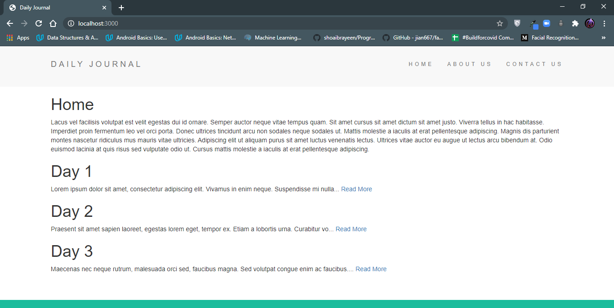
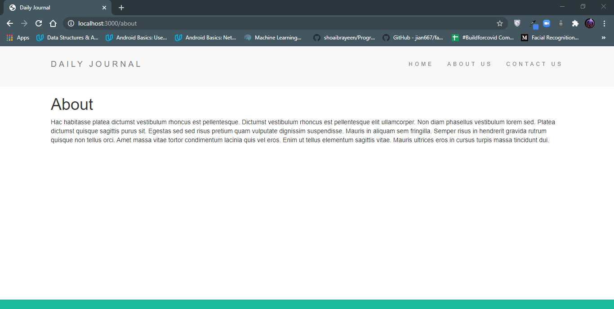
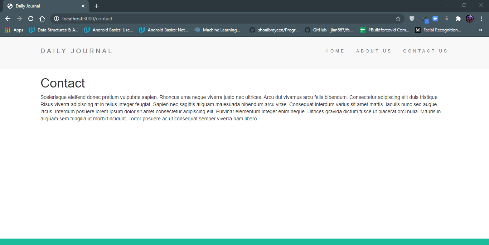
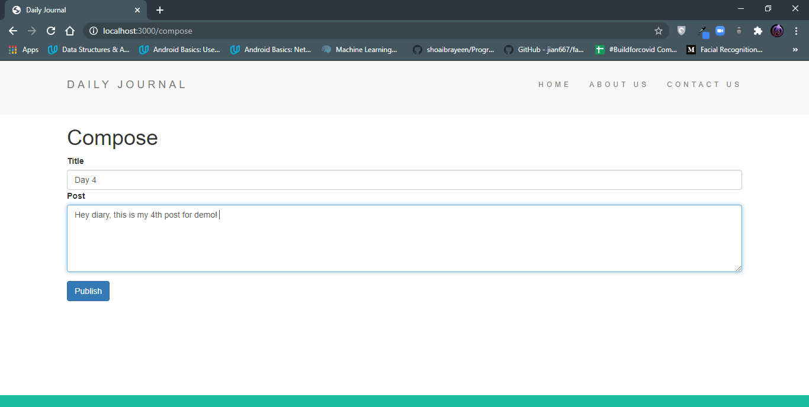
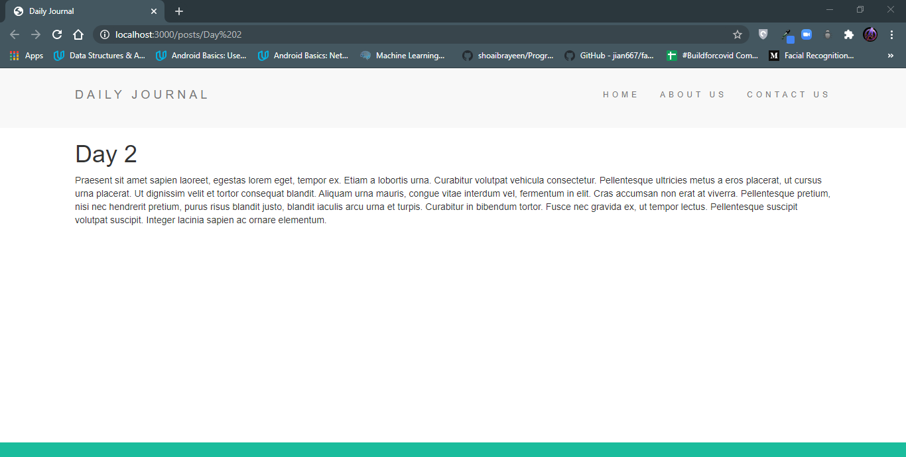

# Blog-website
Created a blog website
This is one of the projects from the course i took by Angela Yu.
The Web app focusses on implementing Full Stack Web Development Using NodeJS and ExpressJS as backend along with use of EJS for templating and layouts functionality for better code structuring. Also used Lodash for working with url and strings.

# Snapshots:
## Home Page-

## About Page-

## Contact Page-

## Compose Page-

## Post Page-

# Inspiration
The inspiration for the website have been taken from the follwing:
* Angela Yu's Complete Web Development Bootcamp Course on Udemy.

In the project directory, you can run:
# npm start
Runs the app in the development mode.
Open http://localhost:3000 to view it in the browser.

